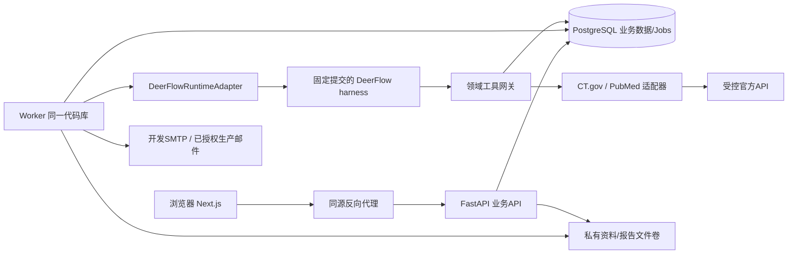

# 04｜技术架构与详细设计

## 1. 总体方案
采用“领域服务模块化单体 + 独立worker进程 + DeerFlow运行适配层”。选用一套模型循环，不再并行部署Dify/额外LangGraph图。此为本项目架构决策。



Mermaid代码是架构说明，未生成图片，也不要求前端安装图编辑器。

## 2. 进程与职责
- Web：仅呈现、状态管理与API客户端。服务端业务不散落到Next.js API Routes。
- API：认证授权、配置、业务CRUD、任务入队、SSE、审核发布、文件授权。
- Worker：ingestion/research/notification任务执行。V1一个research执行槽，其他短IO任务有独立并发上限；通用job表不是第二套Agent Loop。
- DeerFlow：模型消息、工具循环、可选子Agent、运行检查点等上游能力；必须在选定提交验证实际接入方法。[S01][S02]
- 领域工具网关：认证上下文、预算、来源白名单、调用审计、结构化输出；Agent不直接拿数据库DSN和邮件凭据。
- PostgreSQL：业务事实、权限、版本、任务和投递的唯一持久化依据；本地缓存不是事实源。

## 3. 推荐源码布局（待实现，不代表上游现有文件）
```text
apps/web/                         # Next.js
services/pharma/
  app/main.py
  app/api/                        # routers / dependencies / errors
  app/auth/                       # sessions / membership / csrf
  app/modules/
    entities/ sources/ events/ evidence/
    research/ reports/ subscriptions/ delivery/ audit/
  app/agent/
    runtime_protocol.py           # 项目自己的端口
    deerflow_adapter.py           # 上游依赖唯一入口
    replay_adapter.py             # 显著标识的离线回放
    tools/                        # 领域工具，不提供任意shell
  app/worker/                     # claim / lease / dispatch / scheduler
  app/db/                         # SQLAlchemy / Alembic
  tests/
third_party/deer-flow/            # 固定SHA的submodule或vendor；二者选一
contracts/ fixtures/ prompts/ docs/ delivery/
```

不直接复用上游通用聊天UI作为最终产品；可以保留上游作为依赖和开发参考，但产品页面按本包实现。保留上游license与改动清单。

## 4. 运行适配边界
本项目定义的协议：
`start(context, request) -> AsyncIterator[DomainRunEvent]`；`cancel(run_id)`；`recover(run_id, checkpoint_ref)`；`capabilities()`。
这些不是声称 `DeerFlowClient` 已有同名方法。官方说明展示其嵌入式客户端和流式入口，具体取消、上下文、恢复及工具注册必须做M0探针。[S03]
适配器将上游事件映射为本项目事件；只暴露行动摘要、工具摘要、证据和状态，不透传所有debug或模型隐藏推理。

### M0必须证明
可固定SHA安装；可注册至少一个只读自定义工具；能把可信workspace/user/run上下文传给主/子工具；并发不能串上下文；能识别正常完成/错误/取消；能将checkpoint与run绑定；能禁止默认危险工具。
SDK依赖全局配置时，V1采用每研究run独立子进程/串行槽，仍需验证子进程上下文与信号回收；不能靠全局变量在并发run间切换用户。
恢复探针失败时状态recovery_required，提供显式重跑同业务任务的新attempt；不可宣称已经无损续跑。

## 5. 关键链路
### 同步
API鉴权→事务插job→worker领取→适配器拉取→每页持久化observation→锁record后对比上次成功观察→复用或新增snapshot→更新当前读模型→生成event revision→推进成功水位。
### 研究
API创建冻结run→job启动adapter→模型调用领域工具→网关授权与预算→证据持久化→模型提交结构化草稿→确定性校验→语义复核→生成报告版本→完成/partial。
### 发布
锁report→校验current version及review哈希→写published指针→插唯一delivery→提交→投递worker执行→回执/unknown；失败不得重新研究。

## 6. 一致性边界
业务事务不能跨LLM/HTTP/SMTP。外部读调用允许受限重试，结果落库幂等；外部发信需要单独处理未知结果。每次数据库写操作带workspace；复合外键防错关联；RLS作为附加保护由实现者补充并测试，不能只靠ORM默认scope。
长任务不保持数据库长事务。模型看到的是证据快照列表，不是可变“当前网页”。一个报告引用不同抓取日期时必须保存各自日期与覆盖说明。

## 7. 搜索与知识
V1使用标识查询、结构化筛选、英文文本检索及中文业务标签。药物实体不是仅embedding，证据链不是仅向量库。V1.1加向量时必须携带workspace、snapshot版本、访问条件并测试跨workspace召回隔离。

## 8. 技术锁与替代边界
Python/Node版本依据固定上游依赖与所选Next.js共同确定，写入锁文件和容器，不能随意宣称最新版本。数据库选PostgreSQL，V1参考DDL面向PG16+常用能力；执行时记录实际版本。
ToolUniverse属于可选工具目录，V1直接官方适配器减少依赖；后续接入仍经过同一网关，不能绕过证据/权限/限流。[S05]
扩容、Redis共享限流、S3对象存储、SSO都留后续；若先部署多worker，必须实现跨进程预算/来源配额/租约原子性。

## 9. 上游thread标识
由服务端为workspace+run生成稳定短哈希标识，例如`ph_`加SHA256前40位，保持ASCII字母/数字/下划线且小于64字符。真实上下文保存在业务表，不从thread字符串反推权限，不直接拼接两个UUID形成过长上游ID。
